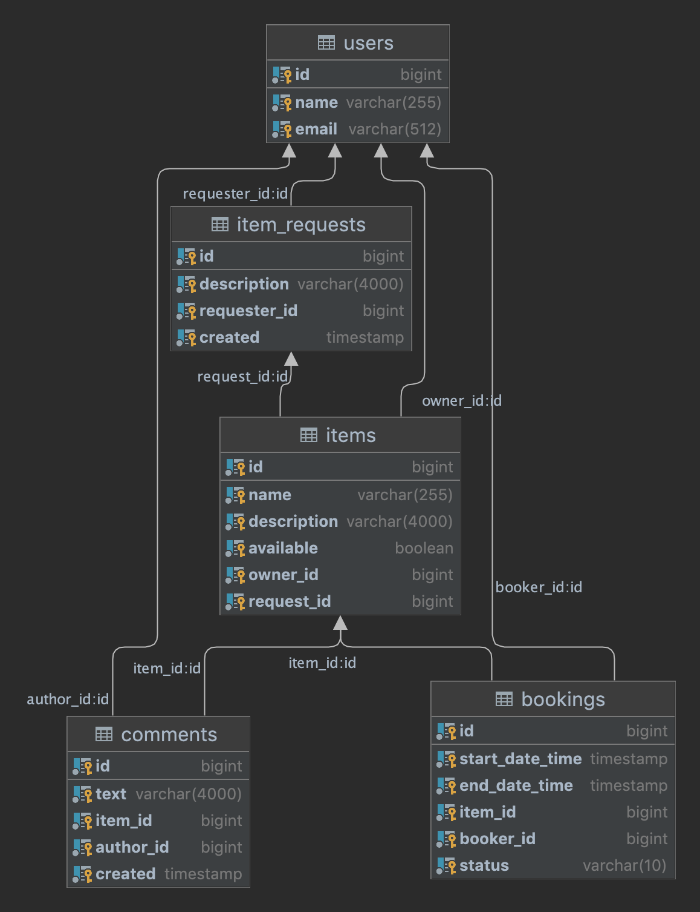

# ShareIt :package:
### Проект:
<p>Приложение позволяющее пользователям делиться своими вещами, помогать находить нужную вещь, брать ее в аренду</p>

---
Приходилось ли вам покупать вещь которой воспользуетесь пару раз, а все остальное время она будет лежать и пылиться ?
<br>Намного проще взять ее в аренду на время. Именно эту проблему решает данный сервис.

---
### Описание сервисов:
REST приложение реализовано с использованием микросервисной архитектуры.
1. Server — основной для работы приложения.
2. Gateway — сервис валидации запросов и масштабирования.

---
### Функциональность
1. Управление пользователями
2. Поиск и просмотр пользователей
3. Управление вещами
4. Поиск нужной вещи, просмотр списка вещей
5. Поиск вещей для бронирования
6. Управление бронированием, запросами других пользователей
7. Возможность оставить отзыв о вещи
---
### Схема базы данных 


---
### Стек технологий
+ [Java](https://www.java.com/)
+ [Spring Boot](https://spring.io/projects/spring-boot)
+ [PostgreSQL](https://www.postgresql.org)
+ [Hibernate](https://hibernate.org)
+ [Docker Compose](https://www.docker.com)
+ [Apache Maven](https://maven.apache.org)
+ [Project Lombok](https://projectlombok.org)
+ [Postman](https://www.postman.com)
+ [IntelliJ IDEA](https://www.jetbrains.com/ru-ru/idea/)

---
### Запуск приложения
Потребуется Java 11, Docker, Git, Apache Maven

1. Склонировать
```shell
git clone https://github.com/kal-an/java-shareit
```
2. Собрать проект
```shell
mvn clean package
```
3. Запустить через Docker Compose
```shell
docker compose up
```
---
### Выполнение тестирования
Подготовлены коллекции тестов, используя Postman
```shell
postman/sprint.json
```